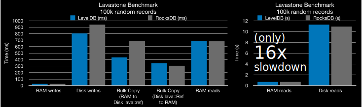

# lavastone 🌋
[](https://github.com/campfireai/lavastone/actions/workflows/demo.yml)
[](LICENSE)


Lavastone provides transparently disk-backed C++ standard library (STL) containers (vector, unordered_map etc.) for arbitrary serializable types.
Disk-backed Lavstone `Ref`s behave nearly identically to in-memory containers, which means code can be trivially adapted to use the disk once the dataset has outgrown the RAM. For our use case, pre-processing our big dataset in memory with C++ and then writing to disk with Lavastone finished in ~1 hour and  we could then spin up cheap disk-backed servers instantly. On the other hand, performing all the indexing directly with a SQL database would take weeks.

___Just replace this:___
```c++
#include <iostream>
#include <string>
#include <vector>

using namespace std;

int main() {
  vector<string> myvec;
  myvec.push_back("hello, world!\n");
  myvec.at(0) = "in memory\n";
  cout << myvec.at(0);
}
```
___with this:___
```c++
#include <iostream>
#include <string>
#include <vector>

#include "lavastone.hpp"

using namespace std;

int main() {
  lava::init();
  lava::Ref<vector<string>> myvec;
  myvec.push_back("hello, world!\n");
  myvec.at(0) = "on disk\n";
  cout << myvec.at(0);
}
```
(bigger demo showing other features [below](#bigger-demo))

**Currently supported:**
- **unordered_map** &mdash; fully supported
- **vector** &mdash; fully supported
- **map** &mdash; works but ordering is guaranteed only for lexicographically-ordered serialization [see below](#extending-to-other-data-types)
- **set** and **unordered set** are treated as vectors i.e. lack uniqueness guarantees (we didn't need these structures but they would be really simple to implement along the lines of the `lava::Ref<Mapping<...>>` if someone wants to open a PR!)

In a typical use pattern, an application will serve some large (~0.1 - 1 TB) dataset with a search index consisting of some STL containers produced by a pre-processing step. During this one-time pre-processing, we can afford a huge-memory instance that can fit all the data in RAM. Once the index containers are produced, they are seamlessly converted to Lavastone containers on disk. The server code can then fit on a tiny-memory instance and all the code written for STL containers will "just work" with a not-terrible slowdown (see benchmarks) of about 16x in our tests.

For certain algorithms not well-suited to a SQL database, such as graph algorithms and ML models, it's much simpler to keep everything in C++ than to have to translate back and forth to the external database. For our use case involving an application that served graph queries to >100M rows of data, performing the pre-processing entirely in postgreSQL would take about a week whereas the in-memory processing + serialization took under an hour. The index was then served just fine by lightweight instances with a reasonably fast SSD. And we didn't have to rewrite all our search engine code in terms of SQL queries.


## Bigger Demo
```c++
#include "lavastone.hpp"
#include <iostream>
#include <string>
#include <vector>
#include <unordered_map>

using namespace std;
int main() {
  // always run this before constructing lava::Ref<>'s:
  lava::init();

  // here is an ordinary memory-backed map:
  unordered_map<string, int> a_map;
  a_map["hello"] = 12;
  cout << a_map["hello"] << "\n";

  // let's make it disk-backed by wrapping in lava::Ref<...>:
  lava::Ref<unordered_map<string, int>> cool_map_on_disk;
  cool_map_on_disk["world"] = 13;
  cout << cool_map_on_disk["world"] << "\n";
  // things works pretty much the same way!

  // lava::Ref also supports vectors and nested types:
  lava::Ref<vector<unordered_map<string, int>>>
    vector_of_maps_on_disk;

  // disk-backed containers play nice with each other:
  vector_of_maps_on_disk.push_back(cool_map_on_disk);
  // and also with memory-backed containers:
  vector_of_maps_on_disk.push_back(a_map);

  // assignment works as expected:
  vector_of_maps_on_disk.at(0) = a_map;
  vector_of_maps_on_disk.at(1) = cool_map_on_disk;
  a_map = vector_of_maps_on_disk.at(0);

  cout << vector_of_maps_on_disk.at(0).at("hello") << "\n";
  cout << vector_of_maps_on_disk.at(1).at("world") << "\n";
}
```


## Benchmarks

Benchmarks above are for sequential and random read-writes with 100k randomly-generated data records on an NVME SSD drive with LevelDB and RocksDB (see build options below).
It is generally faster to do a bulk-serialization to a `lava::Ref` after some pre-computation to prepare a data structure in memory. In many cases it's fine to serve requests from an on-disk `lava::Ref` (at least until the data is fully loaded back into memory by some other thread, if necessary).

```bash
./test_lavastone 100000
```

LevelDB and RocksDB have comparable performance as Lavastone backends.
unsurprisingly, random disk reads are slower (16x) than random memory reads. Lavastone is still reasonably fast due to the highly optimized key-value store backends and a simple container serialization protocol.
For many applications this 16x may be an acceptable slowdown.


### Motivation
We built Lavastone for an application that needed to handle user queries to a big dataset. These queries could not be efficiently executed by an off-the-shelf SQL or graph-based database. Instead, our code populated many large datastructures that could be used to efficiently respond to the queries in production.

The problem we had was that building these index datastructures could take several hours or days, which caused an unacceptable "boot time" of the application. To reduce the boot time, we built these datastructures once in an offline stage on a machine with big RAM, serialized them to disk using Lavastone, and then "booted" into production without any delay serving the data from disk.

1. __Build stage:__ (slow, takes several hours) Parse, clean, aggregate, and index the data with large datastructures and store these to disk
2. __Production stage:__ (fast) Quickly load the index datastructures from disk and respond to user queries about the data using our custom application logic

In fact you can just set `*lava::numids = 0` at the end of your build stage, and use the same block of C++ (the order is what matters) to declare your big data structure `Ref`s in both the build and production stages. As long as the `Ref`s are declared in the same order in both stages, they will see the same data in production as was stored by the build stage.


Lavapack serialization is highly extensible: with one line it can accommodate arbitrary struct types via the fabulous [Boost Fusion library](https://www.boost.org/doc/libs/1_76_0/libs/fusion/doc/html/index.html).
It can similarly accommodate most custom container types that support iteration, see [Usage](#usage).
You could also replace it with

Please see the docs below to [get started](#compile-and-run-tests).

## Getting Started
### Install dependencies
#### Mac OS
```bash
brew install cmake leveldb rocksdb zstd
```
#### Ubuntu
```bash
apt install -y build-essential cmake \
  libleveldb-dev librocksdb-dev libsnappy-dev \
  libzstd-dev libboost-dev \
  libboost-serialization-dev \
  git
```
### Compile and run tests
```bash
git clone https://github.com/campfireai/lavastone.git
cd lavastone
mkdir build
cd build
cmake ..
cmake &mdash;build . &mdash;parallel
./test_lavastone 10000 && ./test_lavapack 10000
```
### Run Demo
```bash
./demo
```

### Build options
- `cmake -DCMAKE_BUILD_TYPE=debug` disable aggressive optimizations
- `cmake -DKVDB=rocksdb` use RocksDB instead of the default LevelDB key-value store backend

## FAQ

___Q: How does this work?___

___A:___ There are several techniques that go into this.
- The `lava::Ref::operator=` is overloaded to instrument stores to a Ref to update the data on disk.
- An implicit conversion operator `lava::Ref<T>::operator T ()`  implements the load from disk to allow Refs to be converted (in most cases*) automatically by the compiler to the referred data type
- [SFINAE](https://en.cppreference.com/w/cpp/language/sfinae) is used to split the implementation of `lava::Ref` for Vector-like and Map-like types

___Q: Why would you use this?___

___A:___ Imagine you implemented some C++ code that ran on a big server, and now need to port it over to a mobile phone with reduced memory.
Or alteratively, you previously ran it on smaller datasets and the dataset has outgrown your memory space.
Finally, lavastone can be used for very fast checkpoint-resume. By doing this:
```
lava::Ref<MyComplicatedType> mydata_ondisk(0);
mydata_ondisk = mydata_inmemory;
```
you chose a unique identifier (0) for your datastructure which will persist across runs.
If we start the app again and declare  `lava::Ref<MyComplicatedType> mydata_ondisk(0);` it can start serving requests *immediately* and at reasonable speed (see [Motivation](#motivation)).


___Q: Why not use a database like SQLite or LevelDB directly?___

___A:___ Using a database  generally requires rewriting your code, such that it no longer works if you were to operate on in-memory data structures (std::vector, std::unordered_map etc.).
The goal of Lavastone is to provide transparently disk-backed standard library containers that you can swap in whenever you find it helpful to have your data stored on disk. You may also get better performance with Lavastone than with (say) an uncompressed SQLite database due to LevelDB's (or RocksDB's) compression.

___Q: Why not use [STXXL](https://stxxl.org/)___

___A:___ STXXL supports POD types only, so it does not play nicely with strings or other non-POD ilk.

___Q: Why implement serialization / deserialization from scratch instead of using [Boost serialization](https://www.boost.org/doc/libs/1_75_0/libs/serialization/doc/tutorial.html)___

___A:___  This way it's self-contained (using only the BTL to [support arbitrary structs](#adapting-a-custom-struct-type)), and in some cases faster (due to lack of metadata / being purely type-driven. But more importantly, we weren't familiar with the Boost serialization libraries at the start of this project. You could absolutely replace lavapack's (Un)Pack functions with boost (de)serialization and get better performance in a lot of cases.


## Adding custom data type support to Lavapack
### Adapting a custom struct type
```c++
#include <string>
#include "lavastone.hpp"

struct MyStruct {
    int my_int;
    std::string my_string;
};

LAVAPACK_ADAPT_STRUCT(MyStruct, my_int, my_string);
```

### Other types
For other type `T`, just implement
```
std::string Pack(const T* data)
void Unpack(const std::string& serialized, T* data)
```
Now lavastone knows how to serialize and deserialize your struct!
Make sure to implement these after `#include "lavapack.hpp"` but before `#include "lavastone.hpp"`.

```c++
// serialize
MyStruct foo = {.my_int=42, .my_string="hello world"};
pack_to_file(&foo, "foo.struct");

// deserialize
MyStruct foo_new;
unpack_from_file("foo.struct", &foo_new);
```

### Usage
The `pack_to_file` and `unpack_from_file` convenience functions simply wrap the core serialization engine, which consists of a library of `Pack` and `Unpack` functions implemented for various fixed-width and container types.
Use these methods to access the raw strings that Lavastone serializes to / from.

### Extending to other data types
Lavapack supports vector-like and map-like container types.
These should have a `begin()` method, which for the map should point to something with a `first` member. This handles most vector-like cases like `std::set, std::unordered_set, std::vector` and map-like cases like `std::map, std::unordered_map`.
If you need to extend to other container types, just implement `Pack(const T*)` and `Unpack(const std::string&, T* out)`. Make sure to do this before including `lavastone.hpp`.

Lavastone supports the same data types as Lavapack but currently there are a few limitations:
- ordered maps `std::map` are only ordered properly if the keys get serialized to correctly (lexicographically) ordered byte sequences (see [leveldb comparator docs](https://github.com/google/leveldb/blob/master/doc/index.md#comparators)).
- Sets are just treated as vectors which is fine if using with a build-production split (i.e., if the set is kept in-memory during the build stage, then written to disk, then served with read-only access during production) but this will pose a problem if you need uniqueness and r/w access to the disk-backed Ref<set> structure.

## Ideas to extend Lavastone:
- Performance optimizations:
    - Implement caching, flushing
    - Optimize leveldb seek for prefix traversal in lava::Ref<map> &mdash;> map conversion
- Features
    - Allow deletion of keys, resizing etc. for all types
    - Implement unordered_sets, sets, and ordered maps properly
    - Essentially make a Ref<someType> more transparently indistinguishable from someType for all the basic standard library data structures
    - Make thread safe [like leveldb itself](https://github.com/google/leveldb/blob/master/doc/index.md#concurrency) &mdash; should just have to replace the  `(*lava::numids)++;` top-level prefix allocation strategy
    - Allow specifying kv db options (directory, etc.), permit isolation in top-level namespaces (maybe change lava from a namespace to a class)


## Development and Contributing
Interested in contributing? We 💙 pull requests!
If you have any suggestions or find a bug, you can [open an issue](https://github.com/deepgram-devs/meeting-bot/issues/new) on this repository.
Please be nice 🙂
